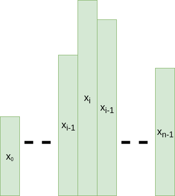
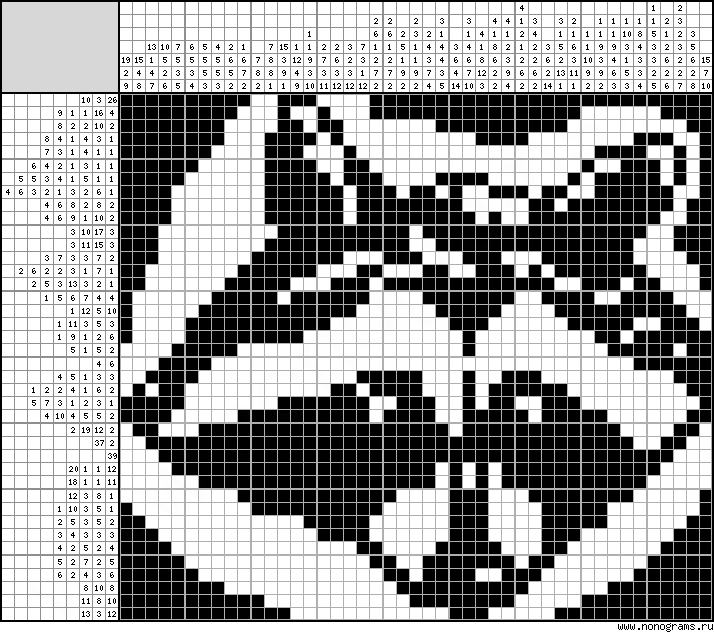

&copy; 2021-2022 Andrei Napruiu

# First PC Homework - Functions and static structures(Arrays, Matrix)

> **Mentions before start:**
> + The actual pdf with all the requirements for this homework can be found [here](https://github.com/andreinapruiu/pdfs-PC/blob/main/Programare_2021___Tema_1.pdf).
> + The README file included in the repo is just so the checker gives 100 points on this homework.
> + After reading what each problem does you can go on and [run the code](#how-to-run-the-code) or [check the problems](#how-to-run-the-checker).

# Contents:
1. [Short Description](#short-description)
1. [Problem 1](#on-the-fly-analysis)
2. [Problem 2](#natural-numbers-properties)
3. [Problem 3](#improving-scores)
4. [Problem 4](#nomogram-checker)

## Short description
This was a homework given during the **PC(Computer Programming)** course in my first year. As seen below, I had to solve 4 different problems of various difficulties. The problems were supposed to be an introduction to C programming language by using static structures, such as arrays and matrixes, or even simple functions to solve algorithmical questions. It was a simple and fun homework. Each of the 4 problems will be described below.

## On the fly analysis
This problem is based on heights of trees in a forest. As seen in the image below, the trees have different heights, already known by us. We name a tree ***special*** if its neighbours are smaller than him.

So, if x<sub>i</sub>>x<sub>i-1</sub> and x<sub>i</sub>>x<sub>i+1</sub>, then x<sub>i</sub> is a special tree.<br>

<br>

We need to find and print the following:
- S - sum of the heights of all the special trees
- m_a - arithmetic mean of the heights of all special trees(7 exact decimals)
- xmax_odd - the maximum height of a special tree with its index an odd number
- xmin_even - the minimum height of a special tree with its index an even number

Input:
+ 9 -> the number of trees
+ 3 1 3 2 2 5 2 4 2 -> heights of trees

Output:
+ 12 -> S
+ 4.0000000 -> m_a
+ 5 -> xmax_odd
+ 3 -> xmin_even

## Natural numbers properties

A general property of natural numbers says that by doing repeteadly the difference between the number formed by taking all the digits in descending order(n_descending) and the number formed by taking the digits in ascending order(n_ascending), after a number of k steps we will find a number that was already seen, thus creating an infinite loop.

For example, for the number 14325 we will have the following iterations:
+ 54321 - 12345 = 41976
+ 97641 - 14679 = 82962
+ 98622 - 22689 = 75933
+ 97533 - 33579 = 63954
+ 96543 - 34569 = 61974
+ 97641 - 14679 = 82962

> So, after 6 steps we found a loop.

We need to print the following:
- the number of differences done before finding the number that creates a loop
- the differences that are inside the loop(just their results)

For the given number 14325 we should print(without the dots):
+ 1
+ 82962 75933 63954 61974

## Improving scores

A student has a number N of courses in which he obtains the grade x<sub>i</sub>. Every course has its number of credits, c<sub>i</sub>. The score is defined as seen below:

$$P = {\left( \sum_{i=0}^{N-1} x_i c_i\right)}$$

After receiving all his grades, the student is curious about finding out the minimum number of courses that need a raise of grade so that he can obtain a scholarship.
> Note: to obtain a scholarship you need to go above a minimum score.

We need to find and print that number.

Input:
- 5 -> number of courses
- 10 10 5 7 5 -> the grades
- 1 2 5 6 4 -> number of credits for each course(corresponding to the grade above)
- 160 -> minimum score for receiving a scholarship

Output:
- The result: 2 -> the 2 grades of 5 are raised to a 10

## Nomogram checker

> For playing nomogram you can click [here](https://www.nonograms.org).

Nomogram is a simple game, such as Sudoku for its playing "field". You have a matrix of N lines and M columns in which every item can be black(value 1) or can remain white(0). 

Using the data, we need to verify if a number of T nomogram puzzles are correctly completed.

Input data:
+ N and M as specified in above
+ N lines containing restrictions for the lines in the matrix
+ M lines containing restrictions for the columns in the matrix
+ the matrix itself

Output:
- Message "Corect" or "Eroare", depending on the case, for each of the T puzzles

> Below is a photo of a nomogram for better understanding. In the upper section we see the columns restrictions, in the left section, the lines restrictions.



## How to run the code?
1. Download the files as shown in the repo;
2. Open a terminal and change the current directory with the one containing the code;
3. Run the following commands for each problem:
	- make
	- ./'name of the generated executable corresponding to the chosen problem'
	- the set of numbers(data)

### Example for the first problem
```bash
student@pc:~$ make
gcc -Wall -Wextra -std=c99 ninel.c -o ninel
gcc -Wall -Wextra -std=c99 codeinvim.c -o codeinvim
gcc -Wall -Wextra -std=c99 vectsecv.c -o vectsecv
gcc -Wall -Wextra -std=c99 nomogram.c -o nomogram
student@pc:~$ ./ninel 
9
3 1 3 2 2 5 2 4 2
12
4.0000000
5
3
```

> The names of the generated executables corresponing each to a different problem are, in order: **ninel, codeinvim, vectsecv, nomogram** as seen in the code above.<br>

## How to run the checker?

1. Download the files as shown in the repo;
2. Open a terminal and change the current directory with the one containing the code;
3. Run the following command:

```bash
student@pc:~$ ./check
```

> You will be prompted with a lot of lines verifying a number of inputs for each problem. All the inputs can be found in **tasks** folder.

> Note: if the command above doesn't work, you first need to use the following command that will install any other tool needed:
```bash
student@pc:~$ ./install.sh
```


***Thank you***
